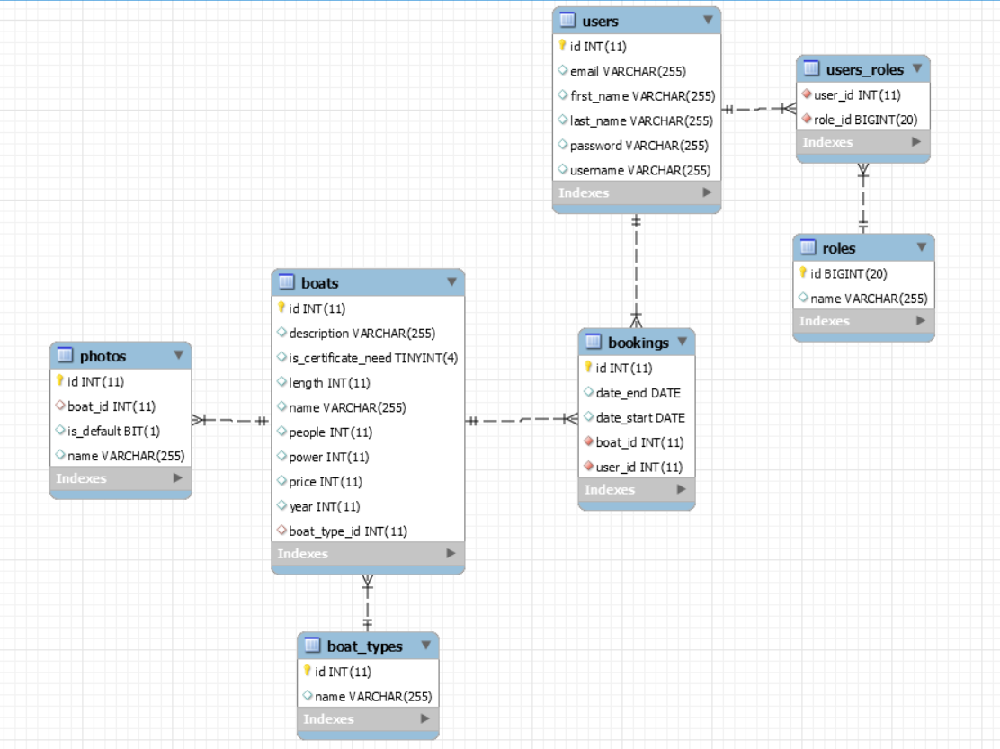

**REST API**

full api documentation available in [wiki](https://github.com/zajan/book-a-boat/wiki)


# 1. Description

The purpose of the application is to provide a booking system for a
boat renting company.  The main task of the app is to eneble users to
browse available boats and make reservations on dates that interest
them. Application has also admin panel which allows to add and edit
boats.

This backend version provides only the REST API. There is no UI.

# 2. Database diagram




# 3. Technology stack

• Spring Boot

• Spring Security

• Spring Data JPA

• Hibernate

• MySQL / H2

• JUnit, Mockito

# 4. How to run

## 4.1. Run with command line

Navigate to the root directory of the project and use following commands.

on windows:
```
mvnw spring-boot:run
```
on mac:
```
./mvnw spring-boot:run
```

## 4.2. Database configuration

By default, book-a-boat app uses h2 database.  

### Run with MySQL

To run app locally using persistent database, it is needed to change profile defined in application.properties file.

**Uncomment this line:**

```
# - mysql database -
# spring.datasource.url=jdbc:mysql://localhost:3306/boats?useSSL=false&serverTimezone=Europe/Berlin

```

**Comment / remove this line:**
```
# - h2 database -
spring.datasource.url=jdbc:h2:mem:testdb;DB_CLOSE_ON_EXIT=FALSE
```

**Provide correct username and password:**

```
spring.datasource.username=root
spring.datasource.password=root
```


**Provide a correct path to folder where you want to store boats images:**

```
# --- file path ---
photostorage.path=D:/bookaboat/img/boats_images/
```

# 5. Authentication

This api uses JWT (JSON Web Token) Authentication.


In authentication, when user successfully logs in using their
credentials, a JSON Web Token will be returned.
This token must be included in header of all requests where
authentication is required.

## Login

Endpoint to login existing user. If authentication is successfull,
returns a token.

```
curl -X POST 'http://localhost:8080/login' \
-H 'Content-Type: application/json' \
-d '{
"username":"admin",
"password":"admin"
}'
```

Example response:

```
{
    "token": "Bearer eyJh12345",
    "username": "admin"
}
```

## Sign-up

Use this endpoint to create new user. New user is getting "ROLE_USER"
assigned by default. If successful, new user object is returned.

```
curl -X POST 'http://localhost:8080/sign-up' \
-H 'Content-Type: application/json' \
--data-raw '{
"username":"new-user",
"password":"password",
  "email": "user@mail.com",
  "firstName": "Gal",
  "lastName": "Anonim"
}'
```
Example response:
```
{
    "id": 95,
    "username": "new-user",
    "password": "$2a$10$3.rrM33bWNxuSWUdcWPFj.yIqqYMqTv/X49IEZBP77hU8w01VNjFi",
    "email": "user@mail.com",
    "firstName": "Gal",
    "lastName": "Anonim",
    "roles": [
        {
            "id": 38,
            "name": "ROLE_USER"
        }
    ]
}
```

## Set admin

Admin can assing "ROLE_ADMIN" to other user by using following endpoint.

```
curl -X POST 'http://localhost:8080/set-admin/{user_id} \

-H 'Authorization: Bearer <generated token>' \
```


# 6. Errors

Error structure:

```
{
    "timestamp": "2020-05-04T18:32:51.186+0000",
    "status": 404,
    "error": "Not Found",
    "message": "Explaining Message",
    "path": "/boats"
}
```

**for endpoints documentation, see [wiki](https://github.com/zajan/book-a-boat/wiki)**